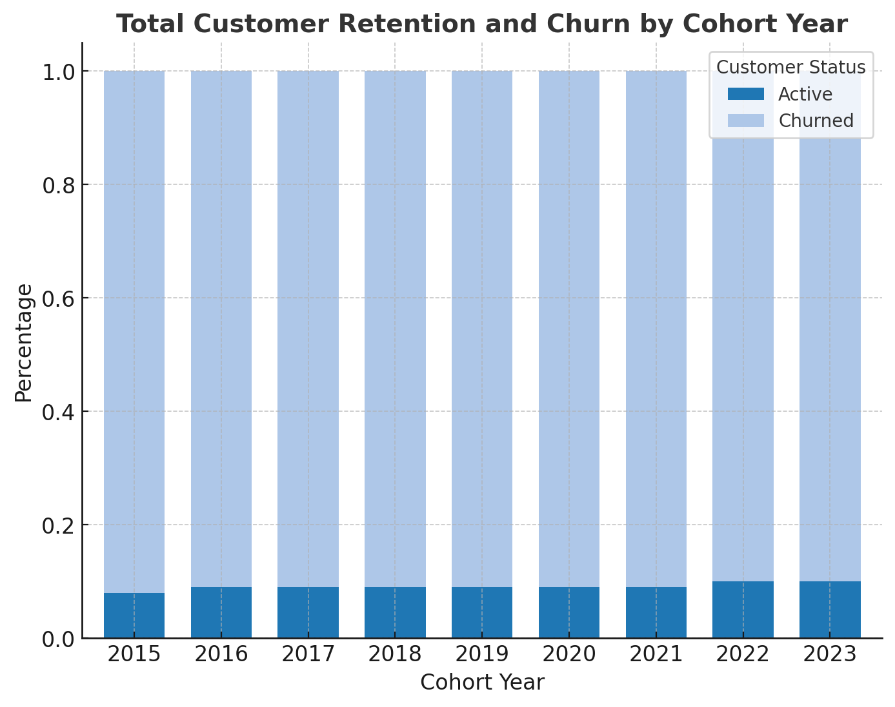

# Intermediate SQL Sales Analytics Project

## Project Objective

This project analyzes transactional sales data from an e-commerce business to understand **customer value, purchasing behavior, cohort performance, and retention patterns**.
The goal is to transform raw sales records into actionable business intelligence using advanced SQL techniques.

The analysis focuses on answering three operational questions:

* Which customers generate the majority of revenue?
* How does customer value evolve across acquisition cohorts?
* Which customers are likely to churn?

---

## Dataset & Environment

**Database:** PostgreSQL
**Query Tool:** DBeaver
**Language:** SQL (Advanced Analytics Queries)

The dataset contains:

* Customer information
* Sales transactions
* Order history
* Revenue metrics with currency normalization

---

## Project Structure

```
intermediate_sql_project/
│
├── 0_create_view.sql
├── 1_customer_segmentation.sql
├── 2_cohort_analysis.sql
├── 3_retention_analysis.sql
├── images/
│   ├── segmentation_output.png
│   ├── cohort_revenue.png
│   ├── retention_analysis.png
│
└── README.md
```

---

## Data Preparation

### View Creation

**Query:** [0) view](<0) view.sql>)

A consolidated analytical view was created to simplify downstream analysis.

Key transformations:

* Aggregated transactional revenue
* Standardized customer attributes
* Calculated customer first purchase date
* Prepared cohort identifiers

This layer acts as the analytical foundation for all subsequent queries.

---

## 1. Customer Segmentation Analysis

**Query:** [1) customer_segmentation](<1)customer_segmentation.sql>)

Customers were segmented based on **Lifetime Value (LTV)** derived from cumulative revenue.

### Methodology

* Calculated total revenue per customer
* Ranked customers by spending behavior
* Assigned value tiers:

  * High Value
  * Mid Value
  * Low Value

### Output


### Insights

* Revenue concentration is highly skewed toward a smaller customer segment.
* A limited group of customers drives the majority of total revenue.
* Lower-value customers represent scale but minimal monetary contribution.

### Business Interpretation

* Retention of high-value customers has disproportionate revenue impact.
* Mid-tier customers represent the strongest expansion opportunity.
* Low-tier customers require behavioral activation rather than discount-heavy strategies.

---

## 2. Cohort Revenue Analysis

**Query:** [2) cohort_analysis](<2) cohort_analysis.sql>)

Customers were grouped into cohorts based on **year of first purchase** to evaluate long-term revenue behavior.

### Methodology

* Derived cohort year using first transaction date
* Aggregated revenue and customer counts per cohort
* Normalized performance relative to cohort lifespan

### Output


### Observations

* Earlier cohorts demonstrate higher long-term spending behavior.
* Recent cohorts show declining revenue contribution.
* Revenue volatility suggests inconsistent retention performance.

### Business Interpretation

* Early lifecycle engagement strongly influences lifetime value.
* Cohort performance degradation indicates acquisition quality or retention issues.
* Stabilization mechanisms such as loyalty systems may improve revenue consistency.

---

## 3. Customer Retention Analysis

**Query:** [3) retention_analysis](<3) retention_analysis.sql>)

Retention patterns were analyzed using customer purchase recency and cohort tracking.

### Methodology

* Identified last purchase activity
* Detected inactive customers
* Measured churn trends across cohorts

### Output



### Observations

* Long-term retention stabilizes after initial customer lifecycle stages.
* Similar churn patterns appear across multiple cohorts.
* Early inactivity strongly predicts long-term disengagement.

### Business Interpretation

* The first customer lifecycle phase is critical.
* Preventive retention strategies outperform late reactivation attempts.
* Targeted interventions should focus on high-value at-risk customers.

---

## SQL Concepts Applied

* Common Table Expressions (CTEs)
* Window Functions
* Cohort Analysis
* Aggregations & Conditional Logic
* Analytical Views
* Customer Lifetime Value Calculation
* Retention Modeling

---

## Strategic Recommendations

### 1. Customer Value Optimization

*(Customer Segmentation Insights)*

Analysis shows strong revenue concentration among a relatively small portion of customers. Strategic focus should prioritize value preservation and controlled expansion.

**Recommended Actions**

* Introduce a **VIP or premium loyalty program** targeting high-value customers who contribute the majority of total revenue.
* Develop **personalized upgrade pathways** for mid-value customers through targeted promotions, bundled offers, and behavioral incentives.
* Implement **price-sensitive engagement campaigns** for low-value customers aimed at increasing purchase frequency rather than acquisition spending.

**Expected Impact**

* Protect primary revenue drivers.
* Gradually migrate mid-tier customers into higher-value segments.
* Improve monetization efficiency across the full customer base.

---

### 2. Cohort Performance Strategy

*(Cohort Revenue Analysis Insights)*

Cohort comparison indicates declining spending behavior among newer customer groups and increased revenue volatility over time.

**Recommended Actions**

* Prioritize **recent acquisition cohorts** with early-stage engagement campaigns to prevent long-term value decline.
* Introduce **loyalty programs or subscription-based models** to stabilize recurring revenue.
* Analyze behavioral characteristics of historically strong cohorts and replicate successful acquisition or retention strategies.

**Expected Impact**

* Improved lifetime value for newer customers.
* Reduced revenue fluctuation across business cycles.
* More predictable long-term revenue growth.

---

### 3. Retention & Churn Prevention

*(Retention Analysis Insights)*

Retention trends indicate that churn risk becomes predictable early in the customer lifecycle.

**Recommended Actions**

* Strengthen engagement during the **first 1–2 years of customer activity**, including onboarding incentives and loyalty rewards.
* Deploy **targeted win-back campaigns** focused on previously high-value customers rather than broad reactivation efforts.
* Establish a **proactive churn detection framework** using purchase inactivity indicators to trigger early intervention.

**Expected Impact**

* Increased long-term retention rates.
* Higher return on retention investment.
* Reduced customer acquisition dependency.


--- 

## Key Outcome

This project demonstrates how SQL alone can be used to move from **raw transactional data → structured analytics → business decision support**.

The workflow mirrors real-world analytics pipelines used in data analyst and business intelligence roles.

---

## Author

Arnav

